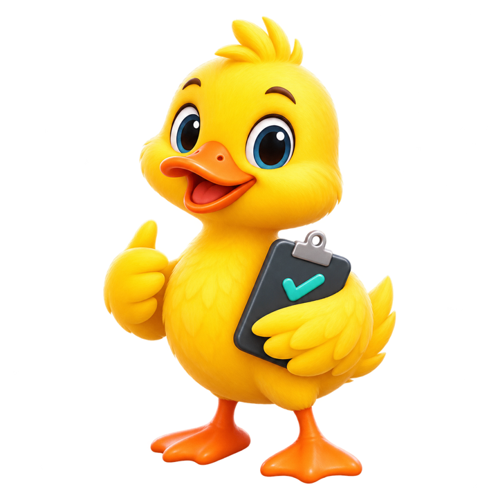
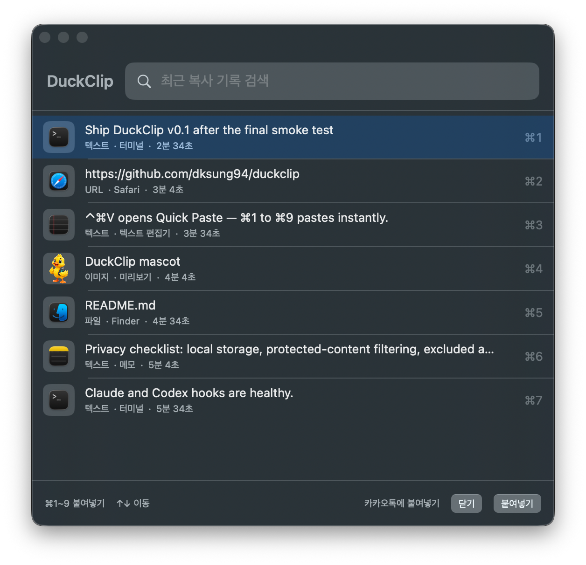
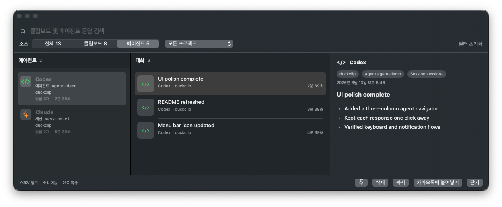
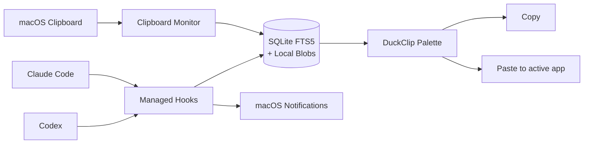

<p align="center">
  
</p>

<h1 align="center">D U C K C L I P</h1>

<p align="center"><strong>Copy once. Find anything. Paste anywhere.</strong></p>

<p align="center">
  클립보드와 Claude Code·Codex 응답을 한곳에서 검색하고,<br>
  키보드만으로 원하는 앱에 바로 붙여넣는 로컬 우선 macOS 팔레트.
</p>

<p align="center">
  <a href="#빠른-시작">빠른 시작</a> ·
  <a href="#두-가지-팔레트">데모</a> ·
  <a href="#왜-duckclip인가요">왜 DuckClip?</a> ·
  <a href="#에이전트-알림">에이전트 알림</a> ·
  <a href="#개인정보-보호">개인정보 보호</a> ·
  <a href="#개발">개발</a>
</p>

<p align="center">
  
  
  
  
</p>

---

DuckClip은 복사 기록과 코딩 에이전트의 최종 응답을 하나의 검색 가능한 라이브러리로 만듭니다. 깊게 찾을 때는 전체 팔레트, 방금 복사한 것을 바로 붙일 때는 Quick Paste를 사용합니다.

> DuckClip은 초기 버전입니다. 중요한 정보에 사용하기 전 보존 기간과 개인정보 제외 설정을 확인하세요.

## 두 가지 팔레트

### Quick Paste — 생각보다 손이 먼저 움직일 때

<p align="center">
  
</p>

`⌃⌘V`를 누르면 최근 클립보드 9개만 담은 작은 패널이 열립니다. 검색하거나 방향키로 고를 수 있고, `⌘1`~`⌘9`를 누르면 해당 항목이 원래 앱에 즉시 붙여넣어집니다. 텍스트·URL·이미지·파일은 썸네일과 원본 앱으로 구분됩니다.

### 전체 팔레트 — 기록과 에이전트 응답을 깊게 찾을 때

<p align="center">
  
</p>

`⇧⌘V`로 전체 팔레트를 열면 클립보드는 `목록 → 미리보기`, 에이전트 응답은 `에이전트 → 대화 → 본문` 순서로 탐색합니다. 프로젝트 필터와 전체 검색으로 긴 기록을 좁힌 뒤, `Return`으로 붙여넣거나 `⌘C`로 다시 복사할 수 있습니다.

에이전트 본문은 Markdown 제목·문단·목록을 보존합니다. 현재 필터에 가려진 새 캡처도 상단 배너가 알려줍니다.

## 왜 DuckClip인가요?

클립보드 도구는 복사 기록만, 에이전트 도구는 각자의 세션만 보여주는 경우가 많습니다. DuckClip은 둘 사이에서 반복되는 탐색과 복사를 줄입니다.

| 불편함 | 보통 생기는 일 | DuckClip의 방식 |
| --- | --- | --- |
| 방금 복사한 내용을 잃음 | 원본 앱과 문서를 다시 찾음 | 고정 항목 우선 + 최신순 타임라인 |
| 스크린샷이 전부 비슷함 | 파일 크기만 보고 하나씩 열어봄 | 썸네일, 해상도, 용량, 원본 앱 표시 |
| 에이전트 답변이 여러 세션에 흩어짐 | Claude와 Codex를 번갈아 탐색 | 에이전트 → 대화 → 본문의 3단 탐색 |
| 방금 복사한 항목을 다시 붙임 | 전체 기록 창을 열고 항목을 찾음 | Quick Paste에서 `⌘1`~`⌘9`로 즉시 붙여넣기 |
| 에이전트가 질문했는데 놓침 | 작업이 입력 대기 상태로 멈춤 | 완료·입력·승인·실패 알림을 개별 제어 |
| 붙여넣기 목적지가 불분명함 | 엉뚱한 앱으로 전송할 수 있음 | `Safari에 붙여넣기`처럼 대상 앱을 명시 |

## 빠른 시작

요구 사항: macOS 14 이상, Swift 6 도구 체인, Xcode Command Line Tools.

```bash
git clone https://github.com/dksung94/duckclip.git
cd duckclip

./scripts/build-app.sh
ditto dist/DuckClip.app /Applications/DuckClip.app
open /Applications/DuckClip.app
```

처음 실행하면 로컬 저장 방식과 기본 단축키를 안내합니다. 자동 붙여넣기와 에이전트 알림은 필요할 때만 권한을 요청합니다.

메뉴바에는 문서 대신 단색 오리 아이콘이 표시되며, 기록 일시 정지나 단축키 오류가 있으면 상태 아이콘으로 바뀝니다.

### Claude Code와 Codex 연결

DuckClip에서 `설정 → Agents → Connections → Install or Update Integrations`를 누릅니다. 설치 후 각 공급자의 `Test` 버튼으로 이벤트 전달을 확인할 수 있습니다.

Codex가 새 훅의 신뢰 여부를 물으면 Codex에서 `/hooks`를 실행해 확인하세요. DuckClip은 기존 훅을 보존하고 자신이 관리하는 명령만 추가하거나 제거합니다.

## 무엇을 기억하나요?

- 텍스트와 URL
- Finder에서 복사한 파일
- 스크린샷과 일반 이미지
- Claude Code 최종 응답
- Codex 최종 응답
- 프로젝트, 에이전트, 세션 메타데이터

검색은 SQLite FTS5를 사용하며, 이미지는 앱의 로컬 Blob 저장소에 보관합니다. 고정하지 않은 항목의 보존 기간은 1일에서 365일까지 설정할 수 있습니다.

## 에이전트 알림

`설정 → Agents → Notifications`에서 필요한 알림만 켤 수 있습니다.

| 알림 | 의미 |
| --- | --- |
| 응답 완료 | Claude Code 또는 Codex가 최종 답변을 마침 |
| 사용자 입력 대기 | 에이전트가 선택이나 추가 정보를 기다림 |
| 승인 필요 | 도구 실행 또는 권한 승인이 필요함 |
| 에이전트 실패 | 에이전트가 오류로 중단됨 |

알림 내용은 `상태만`, `응답 미리보기`, `숨김` 중에서 선택할 수 있으며, 설정 화면에서 네 종류를 각각 테스트할 수 있습니다. 실제 이벤트 지원 범위는 설치된 Claude Code·Codex 훅 버전에 따라 달라질 수 있습니다.

## 키보드로 끝내기

| 키 | 동작 |
| --- | --- |
| `⇧⌘V` | DuckClip 열기 |
| `⌃⌘V` | Quick Paste 열기 |
| `⌘1` … `⌘9` | Quick Paste의 해당 항목 즉시 붙여넣기 |
| `↑` `↓` | 항목 이동 |
| `Return` | 선택 항목 붙여넣기 또는 복사 |
| `⌘C` | 선택 항목 복사 |
| `Delete` | 선택 항목 삭제 |
| `⌘Z` | 최근 삭제 실행 취소 |
| `Esc` | 팔레트 닫기 |

전체 팔레트 단축키는 설정에서 `⇧⌘V`, `⌥⌘V`, `⌃⌥V` 중 선택할 수 있습니다. Quick Paste는 `⌃⌘V`를 사용합니다. 단축키 등록에 실패하면 메뉴바와 설정에서 바로 알려줍니다.

## 개인정보 보호

DuckClip은 클라우드 동기화 없이 이 Mac 안에서만 동작합니다.

- 비밀번호 관리자와 concealed/transient pasteboard 콘텐츠는 기본적으로 기록하지 않습니다.
- 기록에서 제외할 애플리케이션을 직접 선택할 수 있습니다.
- 에이전트 응답에서 제외할 프로젝트 폴더를 지정할 수 있습니다.
- 자동 붙여넣기에만 macOS 손쉬운 사용 권한이 필요합니다.
- Quick Paste의 즉시 붙여넣기도 같은 손쉬운 사용 권한을 사용하며, 권한이 없으면 복사로 전환할 수 있습니다.
- 알림 권한은 사용자가 에이전트 알림을 켜는 시점에만 요청합니다.

저장 위치는 `~/Library/Application Support/DuckClip`입니다.

## 동작 방식



DuckClip은 메뉴바 앱으로 실행되며 Dock을 차지하지 않습니다. 팔레트는 현재 작업 중인 디스플레이에 나타나고, 마지막 위치와 크기를 기억합니다.

## 개발

```bash
# 디버그 빌드
swift build --product DuckClip

# XCTest 없이 실행 가능한 핵심 검사
swift run DuckClipChecks

# 릴리스 앱 번들 생성
./scripts/build-app.sh

# Claude/Codex 연동 상태 확인
swift run duckclipctl status \
  --helper dist/DuckClip.app/Contents/MacOS/duckclip-hook
```

주요 구성:

```text
Sources/DuckClipApp/     전체/Quick Paste 팔레트, 설정, 메뉴바, 알림
Sources/DuckClipCore/    저장소, 검색, 캡처, 훅, 붙여넣기
Sources/DuckClipHook/    Claude/Codex 이벤트 수집 helper
Sources/DuckClipCtl/     연동 설치·진단 CLI
Checks/                  독립 실행형 핵심 검사
scripts/                 앱 패키징과 배포 스크립트
```

---

<p align="center"><strong>Your clipboard has a better memory now. 🦆</strong></p>
